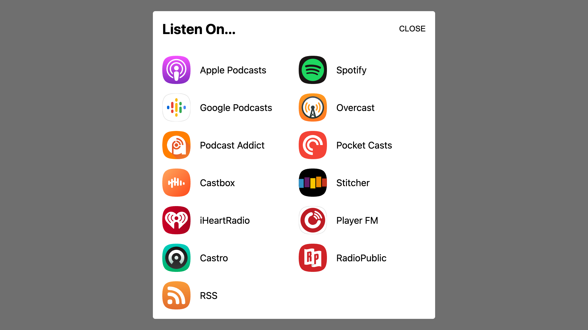

# podlink-embed
Adding podlink as a modal to your site

<picture>
  <source media="(prefers-color-scheme: dark)" srcset="demo-dark.png">
  <source media="(prefers-color-scheme: light)" srcset="demo-light.png">
  
</picture>

## Installation
Insert the following script on any page of your site to enrich all podlinks on the page
```
<script src="https://podlink-embed.netlify.app/embed.bundle.js"></script>
```

## Usage
For web visitors, all they need to do is click a link on your webpage to open the podlink modal and select their preferred podcast app. If they uncheck the "Ask me which app to use every time" checkbox, then we’ll remember their selection in a first party cookie. On subsequent visits, if we detect the prescence of that cookie, we’ll  

## Methods
podlink-embed supports a simple HTML API accessible by manipulating the properties of each link.

### href
The embed script detects any and all links pointing to pages on https://pod.link. Any query parameters added to the href will be passed to all the badges. This includes the [Apple Partner Program](https://performance-partners.apple.com/) parameters to earn affiliate commissions on qualifying purchases.

```
<a href="https://pod.link/vergecast?at=1000lPBj">Listen Now</a>
```

### exclude
If you would like to remove some badges from appearing in the modal for a link, list them within a `data-exclude` attribute seperated by commas.
```
<a href="https://pod.link/vergecast" data-exclude="apple,spotify,google,overcast,podcastaddict,pocketcasts,castbox,stitcher,iheartradio,playerfm,castro,radiopublic,rss">Listen Now</a>
```

### override
If you would like to include a badge but podlink is redirecting to the wrong URL for a platform, you can use the `data-override` attribute to provide some JSON and override the default redirect.
```
<a href="https://pod.link/vergecast" data-override='{
  "overcast":"overcast://x-callback-url/add?url=https://feeds.megaphone.fm/vergecast",
  "radiopublic":"https://radiopublic.com/Vergecast"
}'>Listen Now</a>
```

## Roadmap
* Badge reordering: I haven't figured out the most elegant API just yet
* Make this repo available as an NPM package:
